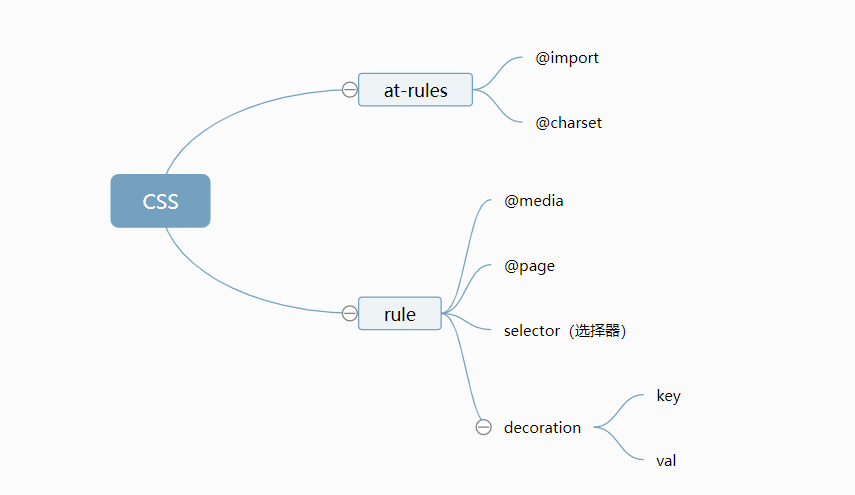

学习笔记
- CSS语法的研究
 CSS总体结构：
@charset (指代规定使用的字符编码)
@import (指定导入的外部样式表或媒体)
rule{
    @media(指定样式表规则用于指定的媒体类型和查询条件)
    @page(设置页面容器的版式，方向，边空等。)
    rule
 } (指代一系列可重复的css规则，我们写css主要写这部分)

初步的脑图结构如下

- CSS@规则的研究
CSS规则分为@规则和普通规则，大部分时候写的是普通规则，@规则写的较为少。但在语法结构上@规则较多，所以有必要研究一下。
开始研究，首先css标准较多，有100多份，从100份标准里面找@相关规则
At-rules
•@charset（规定css字符集） ：https://www.w3.org/TR/css-syntax-3/
•@import ：https://www.w3.org/TR/css-cascade-4/
•@media ：https://www.w3.org/TR/css3-conditional/
•@page ：https://www.w3.org/TR/css-page-3/
•@counter-style ：https://www.w3.org/TR/css-counter-styles-3
•@keyframes ：https://www.w3.org/TR/css-animations-1/
•@fontface：https://www.w3.org/TR/css-fonts-3/
•@supports ：https://www.w3.org/TR/css3-conditional/
•@namespace ：https://www.w3.org/TR/css-namespaces-3/