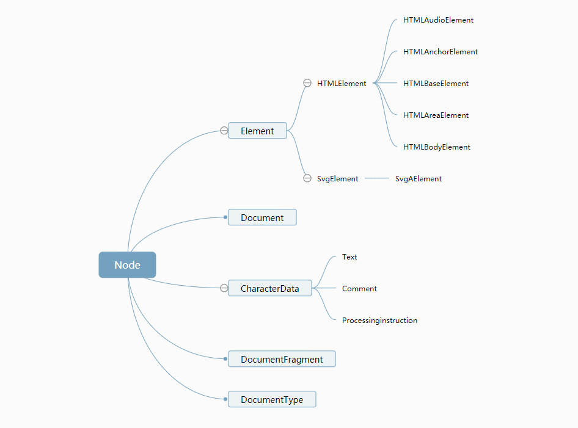

学习笔记
- HTML中实体定义
1写法："&"符号后面加一系列的字，最后一个分号。例如：&nbsp;（no-break space）
用它代替空格，产生的问题是将两个词看成一个词，排版时会产生分词的问题。
2重点要记的：&quot;（双引号）   &lt;（<）   &gt;（>）  &amp;（&符号本身）  

- HTML语义化：
aside:侧边栏；
main:页面主体内容；
article:文章
abbr:包裹某种缩写；
strong:重点突出文章某部分的内容；
em:句子中重点的词；
figure:包裹图文；
nav：导航。

- HTML合法元素：
1 Element:<tagname>...</tagname>
2 Text:文本节点
3 Comment:<!--commnets -->
4 DocumentType:<!Doctype html>
5 ProcessingInstruction:<?a 1?> （预处理语法，并不成功）
6 CDATA:<![CDATA[]]> （特殊的语法，产生的是文本节点，不需要考虑转义）

- 浏览器API之DOMAPI
是浏览器API主要组成部分。
Node：DOM树上能挂着的东西继承自Node类。
如图

导航类操作
parentNode         parentElement
childNodes         children
previousSibling    previousElementSibling
nextSibling        nextElementSibling
firstChild         firstElementChild
lastChid           lastElementChild

修改类操作
appendChild
insetBefore
（以上两个可以实现insertAfter操作）
removeChild
replaceChild

少见需要了解的操作
cloneNode:复制节点，传参为true则包含子节点一起clone，默认情况不克隆子节点。
compareDocumentPosition：比较两个节点关系；
contains:检查一个节点是否包含另一个节点；
isEqualNode:检查两个节点是否完全相同。
isSameNode:检查两个节点是不是同一个节点。（'==='）